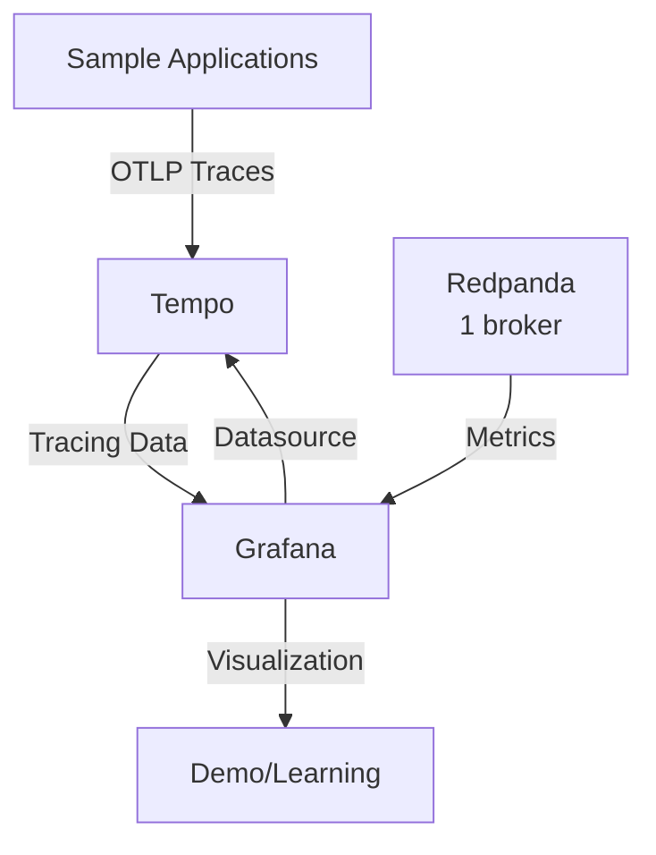
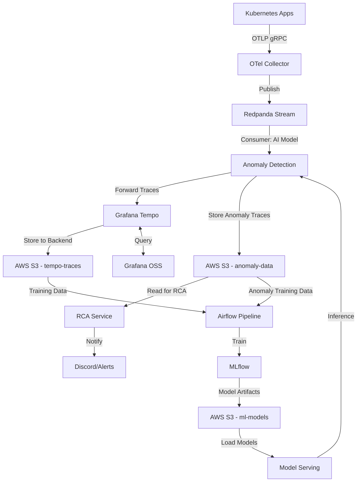

# AI-Rule: Kubernetes Observability & Streaming Platform (Thesis Edition)

**Document Version:** 1.0 (Thesis/Development)  
**Last Updated:** 2026-01-24  
**Status:** Active  
**Scope:** Redpanda, Grafana Tempo, Grafana OSS on Kubernetes (Development/Learning Environment)

---

## System Overview

This AI-Rule specification defines a **simplified governance framework** for deploying an observability and streaming platform on Kubernetes for **academic/thesis purposes**. The platform consists of three core components:

1. **Redpanda** - Kafka-compatible streaming platform for event streaming
2. **Grafana Tempo** - Distributed tracing backend with OpenTelemetry compatibility
3. **Grafana OSS** - Visualization and observability dashboard platform

### Architecture Principles (Simplified for Thesis)

- **Component Isolation**: Each component SHOULD operate in its own namespace (recommended but not strict)
- **Helm-Only Deployment**: Helm charts are the preferred installation method
- **Simplified Configuration**: Focus on functionality over security/HA
- **Learning-Oriented**: Configuration should be easy to understand and modify

### Platform Integration Model



---

## Component Definitions

### 1. Redpanda

**Component ID:** `redpanda-streaming`  
**Version Constraint:** `25.1.x`  
**Helm Chart:** `redpanda/redpanda`  
**Official Repository:** `https://charts.redpanda.com`

**Deployment Mode:** Single-broker (development)

**Official Documentation:**
- Primary: https://docs.redpanda.com/25.1/
- Deployment Guide: https://docs.redpanda.com/25.1/deploy/deployment-option/self-hosted/kubernetes/kubernetes-deploy/

### 2. Grafana Tempo

**Component ID:** `tempo-tracing`  
**Version Constraint:** `2.8.x`  
**Helm Chart:** `grafana/tempo` (single-binary, not distributed)
**Official Repository:** `https://grafana.github.io/helm-charts`

**Deployment Mode:** Single instance (monolithic)

**Official Documentation:**
- Primary: https://grafana.com/docs/tempo/v2.8.x/
- Deployment Guide: https://grafana.com/docs/tempo/v2.8.x/setup/deployment/

### 3. Grafana OSS

**Component ID:** `grafana-visualization`  
**Version Constraint:** `12.0.x`  
**Helm Chart:** `grafana/grafana`  
**Official Repository:** `https://grafana.github.io/helm-charts`

**Deployment Mode:** Single instance

**Official Documentation:**
- Primary: https://grafana.com/docs/grafana/v12.0/
- Kubernetes Installation: https://grafana.com/docs/grafana/v12.0/setup-grafana/installation/kubernetes/

---

## System Workflow & Data Flow Architecture

This section defines the **end-to-end workflow** and **data flow governance** for the integrated observability and AIOps platform. The system combines distributed tracing, streaming data infrastructure, and machine learning to enable automated anomaly detection and root cause analysis.

### Workflow Overview

The platform implements a **streaming-first architecture** where distributed traces flow through multiple processing stages:



### WF-001: Request Ingress & Trace Initialization

**Stage:** Entry point for distributed tracing

**Components:**
- Kubernetes Ingress Controller (e.g., NGINX, Traefik, Istio Gateway)
- W3C Trace Context propagation

**Rules:**
- Ingress Controller MUST implement smart sampling strategy
  - Sample rates should be configurable (e.g., 1%, 10%, 100%)
  - High-value requests (errors, slow requests) SHOULD be sampled at 100%
- Ingress MUST inject W3C Trace Context headers into all requests:
  - `traceparent`: version-trace_id-parent_id-trace_flags
  - `tracestate`: vendor-specific context (optional)
- Trace IDs MUST be globally unique and collision-resistant

**Configuration Example (NGINX Ingress with OpenTelemetry):**
```yaml
apiVersion: v1
kind: ConfigMap
metadata:
  name: nginx-ingress-otel-config
data:
  otlp-endpoint: "otel-collector.observability.svc.cluster.local:4317"
  sampling-rate: "0.1"  # 10% sampling
```

**Evidence:**
- W3C Trace Context: https://www.w3.org/TR/trace-context/
- OpenTelemetry Specification: https://opentelemetry.io/docs/specs/otel/

### WF-002: Application Instrumentation

**Stage:** Span generation from application code

**Components:**
- Application Pods with OpenTelemetry SDK
- Language-specific instrumentation (Java, Python, Node.js, Go)

**Rules:**
- All microservices MUST be instrumented with OpenTelemetry SDK
- Each request MUST generate spans containing:
  - **Execution latency**: Start time, duration
  - **Error information**: Exception type, stack trace, error message
  - **Inter-service dependencies**: Parent-child span relationships
  - **Resource attributes**: service.name, service.version, deployment.environment
  - **Custom attributes**: Business context (user_id, tenant_id, etc.)

**Span Attributes Standard:**
```yaml
# Required attributes
service.name: "user-service"
service.version: "v1.2.3"
deployment.environment: "production"

# HTTP semantic conventions
http.method: "GET"
http.url: "/api/users/123"
http.status_code: 200
http.response_time_ms: 45

# Error attributes (if applicable)
error: true
exception.type: "DatabaseConnectionError"
exception.message: "Connection timeout"
```

**Evidence:**
- OpenTelemetry Semantic Conventions: https://opentelemetry.io/docs/specs/semconv/

### WF-003: Centralized Trace Collection

**Stage:** Aggregation and normalization of trace data

**Components:**
- OpenTelemetry Collector (deployed as DaemonSet or Deployment)

**Rules:**
- Applications MUST export spans via OTLP protocol (gRPC preferred for performance)
- OpenTelemetry Collector endpoint: `otel-collector:4317` (gRPC) or `:4318` (HTTP)
- Collector MUST perform the following functions:
  - **Batching**: Aggregate spans to reduce network overhead (batch size: 512-1024 spans)
  - **Retry logic**: Exponential backoff for failed exports (max retries: 3)
  - **Backpressure handling**: Queue management to prevent data loss during spikes
  - **Attribute normalization**: Standardize attribute names and values
  - **Governance enforcement**: Validate required attributes, drop invalid spans

**Collector Configuration:**
```yaml
receivers:
  otlp:
    protocols:
      grpc:
        endpoint: 0.0.0.0:4317
      http:
        endpoint: 0.0.0.0:4318

processors:
  batch:
    send_batch_size: 1024
    timeout: 10s
  
  attributes:
    actions:
      - key: cluster.name
        value: "prod-k8s-cluster"
        action: upsert

exporters:
  kafka:
    brokers:
      - redpanda.redpanda.svc.cluster.local:9092
    topic: "traces"
    encoding: "otlp_proto"
```

**Evidence:**
- OpenTelemetry Collector: https://opentelemetry.io/docs/collector/

### WF-004: Streaming Backbone (Redpanda)

**Stage:** Central event streaming hub for trace data

**Components:**
- Redpanda cluster (Kafka-compatible)

**Rules:**
- Redpanda MUST act as the **single source of truth** for streaming trace data
- **ONLY Anomaly Detection AI Model** consumes from Redpanda (single consumer)
- All other components (Tempo, RCA) read from MinIO, not Redpanda
- Applications MUST NOT bypass Redpanda and send traces directly to consumers
- Topic configuration:
  - Topic name: `traces`
  - Partitions: Scale based on throughput (recommended: 3-6 partitions for development, 12+ for production)
  - Replication factor: 3 (for production), 1 (for development/thesis)
  - Retention: Short retention (1-3 days) since AI model processes in real-time
  - Compression: `snappy` or `lz4` for optimal performance

**Topic Configuration:**
```bash
kubectl exec -n redpanda redpanda-0 -- rpk topic create traces \
  --partitions 3 \
  --replicas 1 \
  --topic-config retention.ms=259200000 \
  --topic-config compression.type=snappy
```

**Consumer Group:**
- `anomaly-detection-group`: ONLY consumer - AI Anomaly Detection service

**Evidence:**
- Redpanda Kafka compatibility: https://docs.redpanda.com/25.2/

### WF-005: AI-Driven Processing & Forwarding

**Stage:** AI model processes all traces and forwards to downstream services

**Components:**
- Anomaly Detection AI Model (primary data processor)
- Grafana Tempo (trace ingestion)
- AWS S3 (storage for anomalies)

**Rules:**
- Anomaly Detection AI Model is the **ONLY consumer** of Redpanda traces
- AI Model MUST process ALL traces in real-time
- For each trace, AI Model performs **dual actions**:

**Action 1: Forward to Tempo (ALL traces)**
- AI Model MUST forward ALL traces (normal + anomaly) to Grafana Tempo via OTLP/gRPC
- Endpoint: `tempo-distributor.tempo.svc.cluster.local:4317`
- Protocol: OTLP gRPC
- **Purpose**: Tempo ingests and stores traces in its own S3 backend

**Action 2: Store Anomalous Traces (ONLY anomalies)**
- If anomaly detected, AI Model MUST store complete anomalous trace to S3 bucket `anomaly-data`
- Path structure: `s3://anomaly-data/date=YYYY-MM-DD/service=<name>/trace_<id>.parquet`
- Format: **Parquet with Snappy compression** (5-10x smaller than JSON)
- Rationale: Optimizes storage cost and training pipeline performance (columnar access)
- **Purpose**: Fast access for RCA without querying Tempo

**AI Model Output Schema:**
```json
{
  "tempo_forward": {
    "status": "forwarded",
    "endpoint": "tempo-distributor:4317",
    "trace_id": "abc123..."
  },
  "anomaly_result": {
    "is_anomaly": true,
    "anomaly_score": 0.95,
    "anomaly_type": "latency_spike",
    "affected_services": ["user-service"],
    "s3_storage": "s3://anomaly-data/date=2026-01-24/service=user-service/trace_abc123.parquet"
  }
}
```

**Implementation Example (AI Model):**
```python
import pyarrow as pa
import pyarrow.parquet as pq
from datetime import datetime

# After anomaly detection
if is_anomaly:
    # Convert trace to Arrow Table
    trace_table = pa.Table.from_pydict({
        'trace_id': [trace['trace_id']],
        'service_name': [trace['service_name']],
        'timestamp': [trace['timestamp']],
        'spans': [trace['spans']],  # Nested structure supported
        'anomaly_score': [anomaly_score],
        'anomaly_type': [anomaly_type]
    })
    
    # Write to S3 with Snappy compression
    s3_path = f"s3://anomaly-data/date={date}/service={service}/trace_{trace_id}.parquet"
    pq.write_table(
        trace_table,
        s3_path,
        compression='snappy',
        use_dictionary=True  # Additional compression for repeated values
    )
```

**Storage Benefits:**
- **Compression**: 5-10x smaller than JSON (typically 1GB JSON → 100-200MB Parquet)
- **Columnar Access**: Training pipeline can read only needed columns
- **Schema Evolution**: Can add fields without breaking old readers
- **Industry Standard**: Compatible with Spark, Athena, Pandas

**Evidence:**
- Tempo OTLP: https://grafana.com/docs/tempo/v2.9.x/api_docs/
- AWS S3: https://aws.amazon.com/s3/
- Apache Parquet: https://parquet.apache.org/

### WF-006: Tempo Storage & Query Engine

**Stage:** Tempo ingests traces and manages S3 backend storage

**Components:**
- Grafana Tempo (trace ingestion and query engine)
- AWS S3 (`tempo-traces` bucket - Tempo's native backend)
- Grafana OSS (visualization)

**Rules:**
- Grafana Tempo MUST receive traces from AI Model via OTLP protocol
- Tempo acts as **active ingester** and **storage owner**
- Tempo MUST use AWS S3 bucket `tempo-traces` as its **native backend object storage**
- **Tempo owns the data structure**: Block format, compaction, retention are managed by Tempo
- S3 role: **Pure object storage** (HTTP PUT/GET), Tempo defines structure
- Grafana OSS MUST query Tempo via HTTP API for trace search and visualization
- Query patterns supported:
  - Search by trace ID
  - Search by service name
  - Search by span attributes (duration, status, etc.)
  - Service dependency graph visualization

**Tempo Configuration (S3 as Backend Storage):**
```yaml
# Tempo uses S3 as native backend object storage
storage:
  trace:
    backend: s3
    s3:
      bucket: tempo-traces  # Tempo owns this bucket
      endpoint: s3.amazonaws.com
      region: ap-southeast-1
      access_key: ${AWS_ACCESS_KEY_ID}
      secret_key: ${AWS_SECRET_ACCESS_KEY}
    block:
      version: vParquet  # Tempo's internal block format
    wal:
      path: /var/tempo/wal
    
# Tempo manages trace lifecycle
ingester:
  trace_idle_period: 10s
  max_block_duration: 30m

compactor:
  compaction:
    block_retention: 720h  # 30 days
```

**Data Ownership:**
- **Tempo** = Owner of trace data and structure
- **S3** = Storage layer only (no awareness of Tempo's internal format)
- **Structure**: Managed entirely by Tempo (blocks, indexes, metadata)

**Evidence:**
- Tempo S3 backend: https://grafana.com/docs/tempo/v2.9.x/configuration/#s3
- Tempo architecture: https://grafana.com/docs/tempo/v2.9.x/operations/architecture/

### WF-007: Root Cause Analysis from Anomaly Storage

**Stage:** Automated RCA using stored anomalous traces

**Components:**
- RCA Service (orchestration and analysis)
- AWS S3 `anomaly-data` bucket (anomalous traces)
- Notification Service (Discord, Slack, PagerDuty)

**Rules:**
- RCA Service MUST periodically scan AWS S3 bucket `anomaly-data` for new anomalies
- Execution frequency: Every 5-15 minutes (configurable)
- Anomaly traces are **complete, self-contained** (stored by AI Model)
- RCA does NOT need to fetch from Tempo (faster analysis)
- RCA logic MUST identify:
  - **Suspected root-cause service**: Service with earliest anomalous span in trace
  - **Impacted downstream dependencies**: Services affected by cascading failures
  - **Correlation with infrastructure events**: Deployment changes, scaling events (optional)
- RCA output MUST include:
  - Root cause hypothesis (ranked by confidence)
  - Trace visualization links (Grafana Tempo URLs for human review)
  - Recommended remediation actions (runbook links)
- Notifications MUST be sent to configured channels:
  - **Discord webhook**: For team collaboration
  - **Slack**: For production incidents
  - **PagerDuty**: For critical alerts requiring immediate response

**RCA Data Access Pattern:**
```python
# 1. Scan anomaly-data bucket
import boto3
s3_client = boto3.client('s3')
anomalies = s3_client.list_objects_v2(Bucket='anomaly-data', Prefix='date=2026-01-24/')

# 2. For each anomaly, read complete trace (self-contained)
import pyarrow.parquet as pq
for anomaly_file in anomalies['Contents']:
    # Read Parquet file from S3
    s3_path = f"s3://anomaly-data/{anomaly_file['Key']}"
    table = pq.read_table(s3_path)
    full_trace = table.to_pydict()  # Convert to Python dict
    
    # 3. Perform RCA on complete trace
    root_cause = analyze_trace(full_trace)
    
    # 4. Generate Tempo URL for human investigation
    tempo_url = f"http://grafana.local/tempo/trace/{full_trace['trace_id']}"
```

**Evidence:**
- AWS Boto3 SDK: https://boto3.amazonaws.com/v1/documentation/api/latest/index.html
- AWS S3: https://aws.amazon.com/s3/

### WF-008: Notification & Alerting

**Stage:** Automated RCA and alerting

**Components:**
- RCA Service (orchestration and analysis)
- Notification Service (Discord, Slack, PagerDuty)
- MinIO (anomaly trace storage)

**Rules:**
- RCA Service MUST periodically read **anomalous traces** from MinIO bucket `anomaly-data`
- Execution frequency: Every 5-15 minutes (configurable)
- **Data Source**: Complete trace data stored by Anomaly Detection service (not Tempo)
- RCA logic MUST identify:
  - **Suspected root-cause service**: Service with earliest anomalous span in trace
  - **Impacted downstream dependencies**: Services affected by cascading failures
  - **Correlation with infrastructure events**: Deployment changes, scaling events (optional)
- RCA output MUST include:
  - Root cause hypothesis (ranked by confidence)
  - Trace visualization links (Grafana Tempo URLs)
  - Recommended remediation actions (runbook links)
- Notifications MUST be sent to configured channels:
  - **Discord webhook**: For team collaboration
  - **Slack**: For production incidents
  - **PagerDuty**: For critical alerts requiring immediate response

**Discord Notification Format:**
```json
{
  "username": "AIOps RCA Bot",
  "embeds": [{
    "title": "🚨 Anomaly Detected: High Latency in user-service",
    "color": 15158332,
    "fields": [
      {
        "name": "Root Cause",
        "value": "database-service: Connection pool exhaustion",
        "inline": false
      },
      {
        "name": "Affected Services",
        "value": "user-service, order-service, payment-service",
        "inline": false
      },
      {
        "name": "Trace Link",
        "value": "[View in Grafana](http://grafana.local/trace/abc123)",
        "inline": false
      }
    ],
    "timestamp": "2026-01-24T21:00:00Z"
  }]
}
```

**Evidence:**
- Discord Webhooks: https://discord.com/developers/docs/resources/webhook

### WF-009: Continuous Learning & Model Governance

**Stage:** ML model training, versioning, and deployment

**Components:**
- Apache Airflow (workflow orchestration)
- MLflow (model tracking and registry)
- Model Serving Service (inference)
- AWS S3 (training data source and model artifacts storage)
- Grafana Tempo (for querying historical normal traces)

**Rules:**
- Airflow MUST orchestrate periodic model training pipelines
  - Training frequency: Weekly or triggered by data drift detection
  - **Data sources**: 
    - **Normal traces**: Query via Tempo API (Tempo manages `tempo-traces` bucket)
    - **Anomaly traces**: Direct read from S3 `anomaly-data` bucket
- Training pipeline steps:
  1. Data extraction from S3
  2. Feature engineering (calculate aggregate metrics)
  3. Model training (anomaly detection models)
  4. Model evaluation (validation metrics)
  5. Model registration in MLflow
  6. Model artifact upload to S3
- MLflow MUST track:
  - Model parameters and hyperparameters
  - Training metrics (precision, recall, F1-score)
  - Model lineage and versioning
  - Experiment comparison
- Model artifacts MUST be stored in AWS S3:
  - Bucket: `ml-models`
  - Path: `s3://ml-models/model_name/version_X/`
  - Format: Serialized model files (pickle, ONNX, TensorFlow SavedModel)
- Model Serving Service MUST:
  - Load latest approved model version from MLflow registry
  - Support A/B testing between model versions
  - Enable dynamic model updates without service restart
  - Expose model metadata and health endpoints

**Airflow DAG Example:**
```python
from airflow import DAG
from airflow.operators.python import PythonOperator

dag = DAG(
    'anomaly_detection_training',
    schedule_interval='@weekly',
    default_args={'retries': 2}
)

extract_data = PythonOperator(
    task_id='extract_traces_from_s3',
    python_callable=extract_s3_data,
    dag=dag
)

train_model = PythonOperator(
    task_id='train_anomaly_model',
    python_callable=train_model_fn,
    dag=dag
)

register_model = PythonOperator(
    task_id='register_to_mlflow',
    python_callable=register_mlflow,
    dag=dag
)

extract_data >> train_model >> register_model
```

**Evidence:**
- Apache Airflow: https://airflow.apache.org/
- MLflow: https://mlflow.org/

### WF-010: Data Flow Governance Principles

**Cross-cutting rules for the entire workflow:**

1. **Single Consumer Pattern**: Redpanda has ONLY ONE consumer (Anomaly Detection AI Model). This simplifies the architecture and ensures all trace processing goes through ML pipeline.

2. **AWS S3 as Central Storage**: AWS S3 acts as the central data lake. All downstream services (Tempo, RCA, Training) read from S3, not from Redpanda.

3. **AI Model as Gateway**: Anomaly Detection AI Model acts as the gateway between streaming (Redpanda) and storage (S3). All traces pass through AI model for analysis before storage.

3. **Backpressure Handling**: Every component MUST handle backpressure gracefully:
   - OpenTelemetry Collector: Queue limits and sampling
   - Redpanda: Consumer lag monitoring
   - Tempo: Rate limiting on ingestion

4. **Data Quality**: Invalid or malformed traces MUST be logged and dropped, not silently ignored.

5. **Observability of Observability**: The observability platform itself MUST be monitored:
   - Redpanda lag metrics
   - Tempo ingestion rate
   - Anomaly detection processing latency
   - Model inference latency

6. **Security & Access Control**:
   - AWS S3 MUST use IAM roles or access keys with least-privilege policies
   - S3 buckets MUST have separate IAM policies per service (Tempo, RCA, Airflow)
   - For thesis: IAM user with programmatic access is acceptable
   - Redpanda topics SHOULD use ACLs (optional for thesis)
   - MLflow SHOULD implement authentication (optional for thesis)

7. **Storage Management**:
   - AWS S3 buckets:
     - `traces`: Lifecycle policy to transition to Glacier after 90 days, delete after 365 days
     - `anomaly-data`: Lifecycle policy to delete after 90 days
     - `ml-models`: Versioning enabled, keep last N versions via lifecycle rules
   - Redpanda retention SHOULD match business requirements (1-3 days default)
   - Sampling rates SHOULD balance between coverage and cost

### AWS S3 Storage Architecture Summary

**AWS S3 Overview:**
- AWS S3 serves as cloud object storage for the entire platform
- Region: ap-southeast-1 (or your preferred region)
- Access: Via AWS SDK (boto3 for Python, AWS SDK for Java, etc.)

**Three Storage Buckets:**

| Bucket Name | Purpose | Owner/Manager | Written By | Read By | Data Format | Retention |
|-------------|---------|---------------|------------|---------|-------------|-----------|
| `tempo-traces` | ALL distributed traces | **Grafana Tempo** | Tempo (ingester) | Tempo (querier), Airflow (via Tempo API) | Tempo's internal format (vParquet blocks) | 30 days (Tempo compactor) |
| `anomaly-data` | Complete anomalous traces | **AI Model** | AI Model | RCA Service, Airflow | **Parquet with Snappy compression** (complete trace data) | 90 days |
| `ml-models` | ML model artifacts | **MLflow** | MLflow / Airflow | Model Serving, AI Model | Serialized models (pickle, ONNX) | Versioned (last N) |

**Corrected Data Flow:**
1. **All traces**: OTel Collector → Redpanda → **AI Model** → **Tempo (ingest)** → S3 `tempo-traces` (Tempo writes)
2. **Anomaly traces**: AI Model → S3 `anomaly-data` bucket (complete trace for fast RCA)
3. **Tempo storage**: Tempo manages `tempo-traces` bucket structure (blocks, compaction, indexing)
4. **RCA analysis**: RCA reads complete traces from S3 `anomaly-data` bucket (no Tempo query needed)
5. **Training data**: 
   - Normal traces: Airflow queries Tempo API
   - Anomaly traces: Airflow reads from S3 `anomaly-data`
   - Models: Airflow → MLflow → S3 `ml-models` bucket

**Key Design Decisions:**
- **Single Consumer**: Only AI Model consumes from Redpanda → simplifies architecture
- **AI as Gateway**: All traces forwarded to Tempo via AI → ensures ML processing before storage
- **Tempo Owns Storage**: `tempo-traces` bucket structure entirely managed by Tempo (not AI Model)
- **Duplicate Anomaly Storage**: Anomalous traces exist in BOTH `tempo-traces` (via Tempo) and `anomaly-data` (AI Model)
  - **Rationale**: Fast RCA access without Tempo query overhead
  - **Trade-off**: Storage cost vs. RCA performance
- **S3 Role**: Pure object storage layer, no intelligence about data structure
- **Cost Optimization**: S3 lifecycle policies reduce storage costs by moving old data to cheaper tiers

---

## Simplified Deployment Constraints

### DC-001: Namespace Recommendation (Optional)

**Rule:** Each component SHOULD be deployed in its own namespace for organization.

**Suggested Namespaces:**
- Redpanda: `redpanda`
- Tempo: `tempo`
- Grafana: `grafana`

**Alternative:** All components MAY be deployed in a single namespace (e.g., `observability`) for simplicity.

**Evidence:**
- Kubernetes namespaces: https://kubernetes.io/docs/concepts/overview/working-with-objects/namespaces/

**Installation:**
```bash
kubectl create namespace redpanda
kubectl create namespace tempo
kubectl create namespace grafana
```

### DC-002: Helm Repository Setup

**Rule:** Use official Helm repositories.

**Setup Commands:**
```bash
helm repo add redpanda https://charts.redpanda.com
helm repo add grafana https://grafana.github.io/helm-charts
helm repo update
```

**Evidence:**
- Redpanda Helm: https://docs.redpanda.com/25.2/deploy/deployment-option/self-hosted/kubernetes/kubernetes-deploy/
- Helm docs: https://helm.sh/docs/

### DC-003: Version Specification (Recommended)

**Rule:** Specify chart versions to ensure reproducibility.

**Rationale:** Makes it easier to document in thesis and reproduce results.

**Installation Pattern:**
```bash
helm install redpanda redpanda/redpanda \
  --version 25.3.1 \
  --namespace redpanda \
  --create-namespace \
  -f values-dev.yaml
```

**Note:** For thesis purposes, using recent stable versions is acceptable.

### DC-004: Single-Broker Redpanda (Simplified)

**Rule:** For thesis/demo, single-broker Redpanda is acceptable.

**Configuration:**
```yaml
statefulset:
  replicas: 1  # Single broker for development
```

**Rationale:** 
- Reduces resource consumption
- Simplifies deployment and debugging
- Sufficient for demonstrating concepts

**Trade-off:** No high availability, but appropriate for learning environment.

**Evidence:**
- Redpanda can run with 1 broker in development mode
- Reference: https://docs.redpanda.com/25.2/deploy/deployment-option/self-hosted/kubernetes/kubernetes-deploy/#number-of-redpanda-brokers

---

## Simplified Helm Configuration

### HG-001: Minimal Values Files

**Rule:** Keep values files simple and well-documented with comments.

**Example Structure:**
```yaml
# values-redpanda-dev.yaml
# Development configuration for thesis demo

statefulset:
  replicas: 1  # Single broker for development

storage:
  persistentVolume:
    enabled: true
    size: 10Gi  # Reduced size for development
    storageClass: "standard"  # Use default storage class

resources:
  cpu:
    cores: 1  # Reduced for development
  memory:
    container:
      max: 2Gi  # Reduced for development

auth:
  sasl:
    enabled: false  # Disabled for simplicity

tls:
  enabled: false  # Disabled for simplicity

external:
  enabled: false  # ClusterIP only
```

**Rationale:** Clear, commented configuration helps with thesis documentation.

### HG-002: Security Simplification

**Rule:** Security features MAY be disabled for development/thesis environment.

**Acceptable Simplifications:**
- **TLS:** Can be disabled (not recommended for production)
- **SASL Authentication:** Can be disabled for easier testing
- **RBAC:** Can use default ServiceAccount
- **Network Policies:** Not required

**Configuration:**
```yaml
# Simplified security for development
auth:
  sasl:
    enabled: false

tls:
  enabled: false
```

**Warning:** Document in thesis that these are simplified for learning purposes and should be enabled in production.

**Evidence:**
- These are optional features that can be disabled
- Reference: https://docs.redpanda.com/25.2/deploy/deployment-option/self-hosted/kubernetes/kubernetes-deploy/

### HG-003: Resource Reduction

**Rule:** Reduce resource requests/limits for local development or resource-constrained environments.

**Minimal Resources:**

**Redpanda:**
```yaml
resources:
  cpu:
    cores: 1
  memory:
    container:
      max: 2Gi
```

**Grafana:**
```yaml
resources:
  requests:
    cpu: 100m
    memory: 256Mi
  limits:
    cpu: 200m
    memory: 512Mi
```

**Tempo:**
```yaml
resources:
  requests:
    cpu: 100m
    memory: 256Mi
  limits:
    cpu: 500m
    memory: 1Gi
```

**Evidence:**
- Development resources: https://docs.redpanda.com/25.2/deploy/deployment-option/self-hosted/kubernetes/kubernetes-deploy/#resources

---

## Simplified Security Rules (Optional)

### SC-001: TLS - Optional for Development

**Rule:** TLS is OPTIONAL for thesis/development environment.

**Recommendation:** Disable TLS for simplicity unless thesis specifically covers security topics.

**Configuration:**
```yaml
tls:
  enabled: false
```

**Thesis Note:** Document that TLS should be enabled in production environments.

### SC-002: Authentication - Optional

**Rule:** Authentication can be disabled for easier demonstration.

**Configuration:**
```yaml
auth:
  sasl:
    enabled: false
```

**Use Case:** Simplifies client connection strings and demo setup.

### SC-003: Basic RBAC - Use Defaults

**Rule:** Default Kubernetes ServiceAccounts are acceptable.

**Rationale:** Reduces configuration complexity for thesis scope.

**Evidence:**
- Kubernetes default ServiceAccount: https://kubernetes.io/docs/tasks/configure-pod-container/configure-service-account/

---

## Observability Integration Rules

### OI-001: Tempo as Grafana Data Source (Required)

**Rule:** Grafana MUST be configured with Tempo as tracing datasource to demonstrate observability stack.

**Configuration (values-grafana-dev.yaml):**
```yaml
datasources:
  datasources.yaml:
    apiVersion: 1
    datasources:
      - name: Tempo
        type: tempo
        access: proxy
        url: http://tempo.tempo.svc.cluster.local:3100
        isDefault: true
        editable: true
```

**Rationale:** This is core to demonstrating the integrated observability platform in your thesis.

**Evidence:**
- Tempo datasource: https://grafana.com/docs/grafana/v12.0/datasources/tempo/

**Validation:**
```bash
# Port-forward Grafana
kubectl port-forward -n grafana svc/grafana 3000:80

# Login and check Configuration > Data Sources
```

### OI-002: OpenTelemetry Support (Required)

**Rule:** Tempo MUST support OTLP for receiving traces from sample applications.

**Tempo Configuration:**
```yaml
tempo:
  receivers:
    otlp:
      protocols:
        grpc:
          endpoint: 0.0.0.0:4317
        http:
          endpoint: 0.0.0.0:4318
```

**Evidence:**
- Tempo OTLP support: https://grafana.com/docs/tempo/v2.9.x/

**Demo Application:** Use OpenTelemetry auto-instrumentation on sample app to generate traces.

---

## Simplified Storage Rules

### SR-001: Use Default Storage Class

**Rule:** Use Kubernetes cluster's default StorageClass for simplicity.

**Configuration:**
```yaml
storage:
  persistentVolume:
    enabled: true
    size: 10Gi  # Small size for development
    storageClass: ""  # Empty = use default
```

**Rationale:** 
- Works on minikube, kind, k3s, cloud providers
- No need to configure custom storage classes

**Evidence:**
- Kubernetes default storage: https://kubernetes.io/docs/concepts/storage/persistent-volumes/#class-1

### SR-002: Minimal Storage Sizes

**Rule:** Use minimal storage sizes appropriate for demo/thesis.

**Recommended Sizes:**
- Redpanda: 10Gi (sufficient for testing and demos)
- Tempo: 5Gi (short trace retention)
- Grafana: 1Gi (dashboards and config)

**Configuration:**
```yaml
# Redpanda
storage:
  persistentVolume:
    size: 10Gi

# Tempo
persistence:
  enabled: true
  size: 5Gi

# Grafana
persistence:
  enabled: true
  size: 1Gi
```

### SR-003: Short Data Retention

**Rule:** Configure short retention periods to save storage.

**Tempo Retention:**
```yaml
tempo:
  retention: 24h  # 1 day retention for development
```

**Redpanda Retention:**
```yaml
# Topic-level retention (configure per topic)
# retention.ms: 86400000  # 1 day
```

---

## Simplified Deployment Process

### DP-001: Single-Instance Deployments

**Rule:** Deploy single instances of all components for simplicity.

**Configuration Summary:**
- Redpanda: 1 broker
- Tempo: Monolithic mode (not distributed)
- Grafana: 1 replica

**Rationale:** Sufficient for demonstrating functionality in thesis.

### DP-002: Use NodePort or Port-Forward

**Rule:** For local access, use NodePort services or kubectl port-forward.

**NodePort Configuration:**
```yaml
# Grafana
service:
  type: NodePort
  nodePort: 30300  # Access via http://node-ip:30300
```

**Port-Forward (Alternative):**
```bash
# Grafana
kubectl port-forward -n grafana svc/grafana 3000:80

# Tempo
kubectl port-forward -n tempo svc/tempo 3100:3100

# Redpanda
kubectl port-forward -n redpanda svc/redpanda 9092:9092
```

**Rationale:** 
- No need for Ingress controllers
- Works on local development clusters
- Simple to document and demonstrate

**Evidence:**
- Kubernetes Services: https://kubernetes.io/docs/concepts/services-networking/service/
- Port forwarding: https://kubernetes.io/docs/tasks/access-application-cluster/port-forward-access-application-cluster/

---

## Quick Start Installation Guide

### Step 1: Setup Helm Repositories

```bash
helm repo add redpanda https://charts.redpanda.com
helm repo add grafana https://grafana.github.io/helm-charts
helm repo update
```

### Step 2: Create Namespaces

```bash
kubectl create namespace redpanda
kubectl create namespace tempo
kubectl create namespace grafana
```

### Step 3: Create Values Files

**values-redpanda-dev.yaml:**
```yaml
statefulset:
  replicas: 1

storage:
  persistentVolume:
    enabled: true
    size: 10Gi

resources:
  cpu:
    cores: 1
  memory:
    container:
      max: 2Gi

auth:
  sasl:
    enabled: false

tls:
  enabled: false

external:
  enabled: false
```

**values-tempo-dev.yaml:**
```yaml
tempo:
  resources:
    requests:
      cpu: 100m
      memory: 256Mi
    limits:
      cpu: 500m
      memory: 1Gi
  
  receivers:
    otlp:
      protocols:
        grpc:
          endpoint: 0.0.0.0:4317

persistence:
  enabled: true
  size: 5Gi
```

**values-grafana-dev.yaml:**
```yaml
persistence:
  enabled: true
  size: 1Gi

resources:
  requests:
    cpu: 100m
    memory: 256Mi
  limits:
    cpu: 200m
    memory: 512Mi

adminPassword: admin  # For development only

datasources:
  datasources.yaml:
    apiVersion: 1
    datasources:
      - name: Tempo
        type: tempo
        access: proxy
        url: http://tempo.tempo.svc.cluster.local:3100
        isDefault: true
```

### Step 4: Install Components

```bash
# Install Redpanda
helm install redpanda redpanda/redpanda \
  --version 25.3.1 \
  --namespace redpanda \
  -f values-redpanda-dev.yaml

# Install Tempo (use tempo chart, not tempo-distributed)
helm install tempo grafana/tempo \
  --namespace tempo \
  -f values-tempo-dev.yaml

# Install Grafana OSS (Helm chart v9.2.10 = app v12.0.2)
helm install grafana grafana/grafana \
  --version 9.2.10 \
  --namespace grafana \
  -f values-grafana-dev.yaml
```

### Step 5: Access Services

```bash
# Get Grafana admin password (if not set in values)
kubectl get secret -n grafana grafana -o jsonpath="{.data.admin-password}" | base64 --decode ; echo

# Port-forward Grafana
kubectl port-forward -n grafana svc/grafana 3000:80

# Access: http://localhost:3000
# Username: admin
# Password: (from above or 'admin' if set in values)
```

### Step 6: Deploy Sample Application with Tracing

Create a simple instrumented application to generate traces:

```yaml
# sample-app.yaml
apiVersion: v1
kind: ConfigMap
metadata:
  name: otel-config
  namespace: default
data:
  config.yaml: |
    receivers:
      otlp:
        protocols:
          grpc:
          http:
    exporters:
      otlp:
        endpoint: tempo.tempo.svc.cluster.local:4317
        tls:
          insecure: true
    service:
      pipelines:
        traces:
          receivers: [otlp]
          exporters: [otlp]
---
apiVersion: apps/v1
kind: Deployment
metadata:
  name: sample-app
  namespace: default
spec:
  replicas: 1
  selector:
    matchLabels:
      app: sample-app
  template:
    metadata:
      labels:
        app: sample-app
    spec:
      containers:
      - name: app
        image: your-sample-app:latest  # Replace with your instrumented app
        env:
        - name: OTEL_EXPORTER_OTLP_ENDPOINT
          value: "http://tempo.tempo.svc.cluster.local:4318"
        - name: OTEL_SERVICE_NAME
          value: "sample-app"
```

---

## Validation and Testing Checklist

### Basic Deployment Verification

- [ ] All namespaces created
- [ ] Helm releases installed successfully
- [ ] All pods running (`kubectl get pods -A`)
- [ ] PersistentVolumeClaims bound

```bash
# Check all pods
kubectl get pods -n redpanda
kubectl get pods -n tempo
kubectl get pods -n grafana

# Check PVCs
kubectl get pvc -n redpanda
kubectl get pvc -n tempo
kubectl get pvc -n grafana
```

### Functionality Testing

- [ ] Grafana accessible via port-forward/NodePort
- [ ] Login to Grafana successful
- [ ] Tempo datasource configured in Grafana
- [ ] Tempo datasource connection test successful
- [ ] Sample application deployed and generating traces
- [ ] Traces visible in Grafana Explore → Tempo

### Thesis Demonstration Scenarios

1. **Show Event Streaming:**
   - Produce messages to Redpanda topic
   - Consume messages from topic
   - Screenshot for thesis documentation

2. **Show Distributed Tracing:**
   - Generate HTTP requests to sample app
   - View traces in Grafana
   - Demonstrate trace visualization
   - Screenshot trace details

3. **Show Observability Integration:**
   - Demonstrate Tempo as Grafana datasource
   - Show unified observability view
   - Document in thesis

---

## Evidence Mapping (Simplified)

All simplified rules align with official documentation but are configured for development/learning:

### Official Documentation References

| Component | Documentation URL | Version |
|-----------|------------------|---------|
| Redpanda | https://docs.redpanda.com/25.1/ | 25.1.x |
| Grafana Tempo | https://grafana.com/docs/tempo/v2.8.x/ | 2.8.x |
| Grafana OSS | https://grafana.com/docs/grafana/v12.0/ | 12.0.2 (Helm chart 9.2.10) |
| Kubernetes | https://kubernetes.io/docs/ | Latest |
| Helm | https://helm.sh/docs/ | Latest |

---

## Thesis Documentation Guidelines

### What to Include in Your Thesis

1. **Architecture Diagram:**
   - Show Redpanda, Tempo, Grafana integration
   - Kubernetes components (namespaces, pods, services)

2. **Configuration Decisions:**
   - Explain why single-instance deployment chosen
   - Document security simplifications and their trade-offs
   - Justify resource allocation decisions

3. **Deployment Process:**
   - Step-by-step installation commands
   - Screenshots of successful deployments
   - Configuration files in appendix

4. **Demonstration Results:**
   - Screenshots of Grafana dashboard
   - Sample traces from test application
   - Performance metrics (if applicable)

5. **Limitations and Future Work:**
   - Acknowledge single-instance limitations
   - Discuss production-ready improvements needed
   - Suggest HA configurations for production

---

## Commands Reference

### Installation
```bash
# Add repos
helm repo add redpanda https://charts.redpanda.com
helm repo add grafana https://grafana.github.io/helm-charts
helm repo update

# Create namespaces
kubectl create namespace redpanda
kubectl create namespace tempo
kubectl create namespace grafana

# Install (with values files)
helm install redpanda redpanda/redpanda --namespace redpanda -f values-redpanda-dev.yaml
helm install tempo grafana/tempo --namespace tempo -f values-tempo-dev.yaml
helm install grafana grafana/grafana --version 9.2.10 --namespace grafana -f values-grafana-dev.yaml
```

### Verification
```bash
# Check deployments
kubectl get all -n redpanda
kubectl get all -n tempo
kubectl get all -n grafana

# Check storage
kubectl get pvc -A

# View logs
kubectl logs -n redpanda redpanda-0
kubectl logs -n tempo $(kubectl get pod -n tempo -l app=tempo -o name)
kubectl logs -n grafana $(kubectl get pod -n grafana -l app.kubernetes.io/name=grafana -o name)
```

### Access
```bash
# Port-forward services
kubectl port-forward -n grafana svc/grafana 3000:80
kubectl port-forward -n tempo svc/tempo 3100:3100
kubectl port-forward -n redpanda svc/redpanda 9092:9092

# Get Grafana password
kubectl get secret -n grafana grafana -o jsonpath="{.data.admin-password}" | base64 --decode ; echo
```

### Cleanup
```bash
# Uninstall releases
helm uninstall redpanda -n redpanda
helm uninstall tempo -n tempo
helm uninstall grafana -n grafana

# Delete namespaces
kubectl delete namespace redpanda tempo grafana
```

---

## Resource Requirements Summary

### Minimum Cluster Requirements

- **Kubernetes Cluster:** 
  - Minikube / kind / k3s / Docker Desktop Kubernetes
  - Single node acceptable
  - 4 CPU cores, 8GB RAM minimum

- **Storage:**
  - ~20Gi total for all components
  - Default StorageClass with dynamic provisioning

### Component Resource Allocation

| Component | CPU Request | Memory Request | Storage |
|-----------|-------------|----------------|---------|
| Redpanda | 1 core | 2Gi | 10Gi |
| Tempo | 100m | 256Mi | 5Gi |
| Grafana | 100m | 256Mi | 1Gi |
| **Total** | **~1.2 cores** | **~2.5Gi** | **~16Gi** |

---

**END OF SIMPLIFIED AI-RULE SPECIFICATION (THESIS EDITION)**

> **Note for Thesis Committee:** This configuration is optimized for learning, demonstration, and resource-constrained environments. Production deployments would require enhanced security (TLS, authentication), high availability (multiple replicas, anti-affinity), and increased resource allocation as documented in the official vendor documentation.
