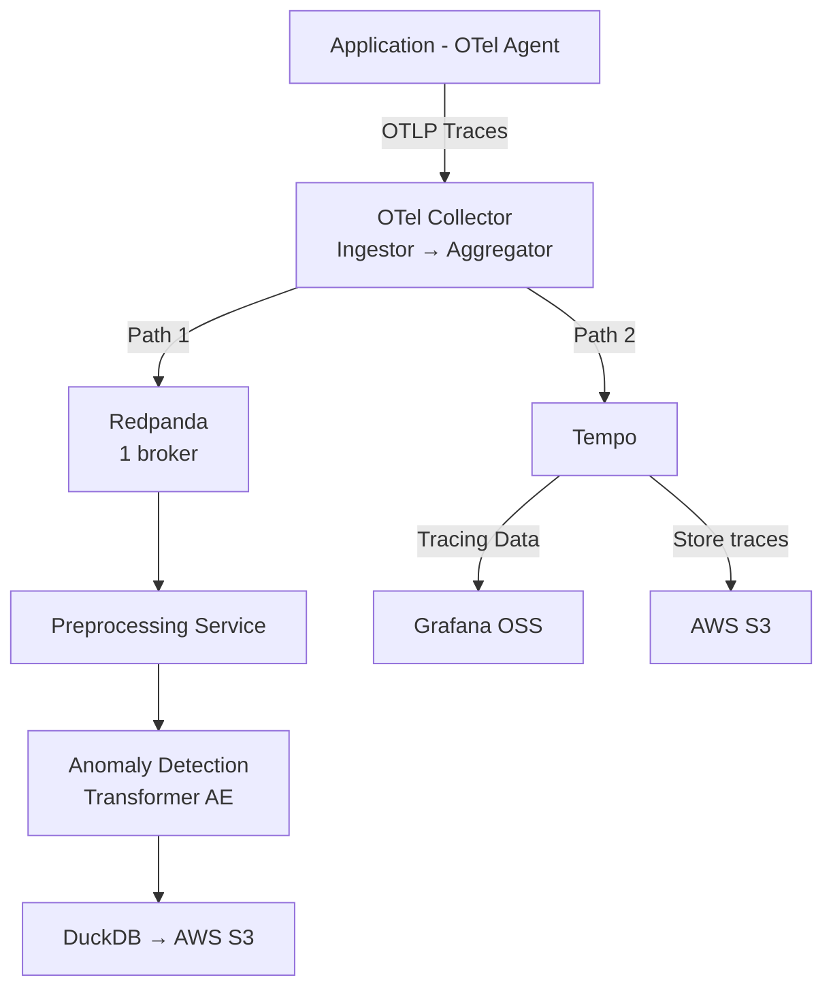
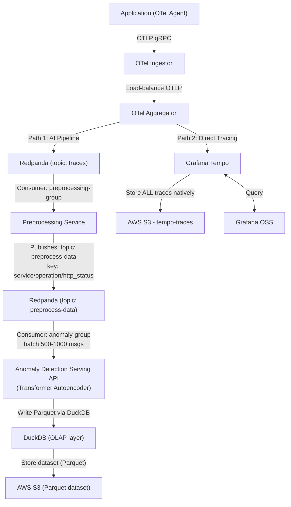

# AI-Rule: Kubernetes Observability & Streaming Platform (Thesis Edition)

**Document Version:** 1.0 (Thesis/Development)  
**Last Updated:** 2026-01-24  
**Status:** Active  
**Scope:** Redpanda, Grafana Tempo, Grafana OSS on Kubernetes (Development/Learning Environment)

---

## System Overview

This AI-Rule specification defines a **simplified governance framework** for deploying an observability and streaming platform on Kubernetes for **academic/thesis purposes**. The platform consists of three core components:

1. **Redpanda** - Kafka-compatible streaming platform for event streaming
2. **Grafana Tempo** - Distributed tracing backend with OpenTelemetry compatibility
3. **Grafana OSS** - Visualization and observability dashboard platform

### Architecture Principles (Simplified for Thesis)

- **Component Isolation**: Each component SHOULD operate in its own namespace (recommended but not strict)
- **Helm-Only Deployment**: Helm charts are the preferred installation method
- **Simplified Configuration**: Focus on functionality over security/HA
- **Learning-Oriented**: Configuration should be easy to understand and modify

### Platform Integration Model



---

## Component Definitions

### 1. Redpanda

**Component ID:** `redpanda-streaming`  
**Version Constraint:** `25.1.x`  
**Helm Chart:** `redpanda/redpanda`  
**Official Repository:** `https://charts.redpanda.com`

**Deployment Mode:** Single-broker (development)

**Official Documentation:**
- Primary: https://docs.redpanda.com/25.1/
- Deployment Guide: https://docs.redpanda.com/25.1/deploy/deployment-option/self-hosted/kubernetes/kubernetes-deploy/

### 2. Grafana Tempo

**Component ID:** `tempo-tracing`  
**Version Constraint:** `2.8.x`  
**Helm Chart:** `grafana/tempo` (single-binary, not distributed)
**Official Repository:** `https://grafana.github.io/helm-charts`

**Deployment Mode:** Single instance (monolithic)

**Official Documentation:**
- Primary: https://grafana.com/docs/tempo/v2.8.x/
- Deployment Guide: https://grafana.com/docs/tempo/v2.8.x/setup/deployment/

### 3. Grafana OSS

**Component ID:** `grafana-visualization`  
**Version Constraint:** `12.0.x`  
**Helm Chart:** `grafana/grafana`  
**Official Repository:** `https://grafana.github.io/helm-charts`

**Deployment Mode:** Single instance

**Official Documentation:**
- Primary: https://grafana.com/docs/grafana/v12.0/
- Kubernetes Installation: https://grafana.com/docs/grafana/v12.0/setup-grafana/installation/kubernetes/

---

## System Workflow & Data Flow Architecture

This section defines the **end-to-end workflow** and **data flow governance** for the integrated observability and AIOps platform. The system combines distributed tracing, streaming data infrastructure, and machine learning to enable automated anomaly detection and root cause analysis.

### Workflow Overview

The platform implements a **dual-path, parallel export architecture** where distributed traces are collected centrally and then fan out into two concurrent pipelines:



### WF-001: Request Ingress & Trace Initialization

**Stage:** Entry point for distributed tracing

**Components:**
- Kubernetes Ingress Controller (e.g., NGINX, Traefik, Istio Gateway)
- W3C Trace Context propagation

**Rules:**
- Ingress Controller MUST implement smart sampling strategy
  - Sample rates should be configurable (e.g., 1%, 10%, 100%)
  - High-value requests (errors, slow requests) SHOULD be sampled at 100%
- Ingress MUST inject W3C Trace Context headers into all requests:
  - `traceparent`: version-trace_id-parent_id-trace_flags
  - `tracestate`: vendor-specific context (optional)
- Trace IDs MUST be globally unique and collision-resistant

**Configuration Example (NGINX Ingress with OpenTelemetry):**
```yaml
apiVersion: v1
kind: ConfigMap
metadata:
  name: nginx-ingress-otel-config
data:
  otlp-endpoint: "otel-collector.observability.svc.cluster.local:4317"
  sampling-rate: "0.1"  # 10% sampling
```

**Evidence:**
- W3C Trace Context: https://www.w3.org/TR/trace-context/
- OpenTelemetry Specification: https://opentelemetry.io/docs/specs/otel/

### WF-002: Application Instrumentation

**Stage:** Span generation from application code

**Components:**
- Application Pods with OpenTelemetry SDK
- Language-specific instrumentation (Java, Python, Node.js, Go)

**Rules:**
- All microservices MUST be instrumented with OpenTelemetry SDK
- Each request MUST generate spans containing:
  - **Execution latency**: Start time, duration
  - **Error information**: Exception type, stack trace, error message
  - **Inter-service dependencies**: Parent-child span relationships
  - **Resource attributes**: service.name, service.version, deployment.environment
  - **Custom attributes**: Business context (user_id, tenant_id, etc.)

**Span Attributes Standard:**
```yaml
# Required attributes
service.name: "user-service"
service.version: "v1.2.3"
deployment.environment: "production"

# HTTP semantic conventions
http.method: "GET"
http.url: "/api/users/123"
http.status_code: 200
http.response_time_ms: 45

# Error attributes (if applicable)
error: true
exception.type: "DatabaseConnectionError"
exception.message: "Connection timeout"
```

**Evidence:**
- OpenTelemetry Semantic Conventions: https://opentelemetry.io/docs/specs/semconv/

### WF-003: Centralized Trace Collection (Ingestor → Aggregator)

**Stage:** Two-tier OTel Collector pipeline — receive, normalize, then fan out

**Components:**
- **OTel Ingestor** — Receives OTLP from apps, load-balances to Aggregator nodes
- **OTel Aggregator** — Groups spans by trace, then exports in **parallel** to two downstream paths

**Rules:**
- Applications MUST export spans via OTLP/gRPC to the Ingestor (`otel-ingestor:4317`)
- Ingestor MUST load-balance across all Aggregator pods using headless DNS resolver
- Aggregator MUST perform:
  - **Group-by-trace**: Collect all spans for a trace before forwarding (`groupbytrace` processor)
  - **Batching**: Aggregate spans to reduce network overhead
  - **Retry logic**: Exponential backoff for failed exports (max retries: 3)
  - **Attribute normalization**: Standardize attribute names and values
- Aggregator MUST export to **both paths simultaneously** (parallel fan-out):
  - **Path 1** → Redpanda `traces` topic (Kafka exporter)
  - **Path 2** → Grafana Tempo via OTLP/gRPC

**Aggregator Configuration (Dual Export):**
```yaml
receivers:
  otlp:
    protocols:
      grpc:
        endpoint: 0.0.0.0:4317
      http:
        endpoint: 0.0.0.0:4318

processors:
  groupbytrace:
    wait_duration: 3s
    num_traces: 1000
  batch:
    send_batch_size: 1024
    timeout: 10s

exporters:
  # Path 1: AI/ML pipeline via Redpanda
  kafka:
    brokers:
      - redpanda.redpanda.svc.cluster.local:9092
    topic: "traces"
    encoding: "otlp_proto"
  # Path 2: Direct trace storage via Tempo
  otlp/tempo:
    endpoint: "tempo.tempo.svc.cluster.local:4317"
    tls:
      insecure: true

service:
  pipelines:
    traces:
      receivers: [otlp]
      processors: [groupbytrace, batch]
      exporters: [kafka, otlp/tempo]  # parallel fan-out
```

**Evidence:**
- OpenTelemetry Collector: https://opentelemetry.io/docs/collector/
- Kafka Exporter: https://github.com/open-telemetry/opentelemetry-collector-contrib/tree/main/exporter/kafkaexporter

### WF-004: Streaming Backbone — Path 1 (Redpanda → Preprocessing → Anomaly Detection)

**Stage:** AI/ML pipeline triggered by OTel Aggregator's Kafka export

**Components:**
- Redpanda cluster (Kafka-compatible, two topics: `traces`, `preprocess-data`)
- Preprocessing Service (consumer + feature extractor)
- Anomaly Detection Serving API (sequence-based ML inference via Transformer Autoencoder)
- DuckDB (embedded OLAP for writing Parquet to S3)
- AWS S3 (Parquet dataset storage)

**Data Flow:**
```
OTel Aggregator
  └─► Redpanda [topic: traces]
        └─► Preprocessing Service (consumer-group: preprocessing-group)
              └─► Redpanda [topic: preprocess-data]
                    │  key: <service>/<operation>/<http_status>
                    └─► Anomaly Detection Serving API (consumer-group: anomaly-group)
                          └─► DuckDB (OLAP layer)
                                └─► AWS S3 (Parquet dataset)
```

#### WF-004a: Topic Configuration

**Rules:**
- **Topic `traces`**: Raw OTLP spans from OTel Aggregator
  - Partitions: 3-6 (development), 12+ (production)
  - Replication factor: 1 (dev/thesis), 3 (production)
  - Retention: 1-3 days
  - Compression: `snappy`
  - Consumer group: `preprocessing-group` (Preprocessing Service ONLY)
- **Topic `preprocess-data`**: Feature-engineered trace data
  - Same partition/retention settings as `traces`
  - **Partition key**: `<service_name>/<operation_name>/<http_status>`
  - Consumer group: `anomaly-group` (Anomaly Detection Serving API ONLY)

> [!IMPORTANT]
> Sử dụng partition key `<service>/<operation>/<http_status>` đảm bảo các bản ghi cùng context sẽ được ghi vào cùng một partition của topic đích, giúp các instance của mô hình phát hiện bất thường nhận được chuỗi span có cùng context theo đúng thứ tự từ một partition duy nhất.

**Topic Setup:**
```bash
# Create both topics
kubectl exec -n redpanda redpanda-0 -- rpk topic create traces \
  --partitions 3 --replicas 1 \
  --topic-config retention.ms=259200000 \
  --topic-config compression.type=snappy

kubectl exec -n redpanda redpanda-0 -- rpk topic create preprocess-data \
  --partitions 3 --replicas 1 \
  --topic-config retention.ms=259200000 \
  --topic-config compression.type=snappy
```

**Evidence:**
- Redpanda Kafka compatibility: https://docs.redpanda.com/25.2/

#### WF-004b: Preprocessing Service

**Stage:** Feature extraction and data enrichment from raw spans

**Mechanism:**
1. Đọc dữ liệu raw log từ OTel Collector thông qua Redpanda topic `traces`
2. Trích xuất các feature cần thiết từ raw log: `operation`, `duration`, `service`, v.v.
3. Đẩy dữ liệu vào Redpanda topic `preprocess-data` với key `<tên service>/<tên operation>/<http status>`

**Rules:**
- Preprocessing Service MUST consume from topic `traces` (consumer group: `preprocessing-group`)
- MUST extract features: operation name, duration, service name, HTTP status, error info
- MUST publish enriched records to topic `preprocess-data`
- **Partition key format**: `<service_name>/<operation_name>/<http_status>`
  - Example: `user-service/GET /api/users/200`
  - This ensures spans with the same context land on the same partition

**Code Reference:**
- https://github.com/MeetingTeam/ml-anomaly-detection/blob/main/src/data_preprocessing.py

#### WF-004c: Anomaly Detection Serving API

**Stage:** Sequence-based anomaly detection using Transformer Autoencoder

**Role:**
- Là service chạy mô hình phát hiện bất thường theo chuỗi (sequence-based anomaly detection model)
- Tiêu thụ dữ liệu đã được tiền xử lý, nhóm dữ liệu theo context để tạo thành các chuỗi span
- Tính toán điểm bất thường (anomaly score) cho từng chuỗi
- Kết quả phát hiện cùng dữ liệu đầu vào được lưu trữ vào AWS S3 dưới dạng Parquet thông qua DuckDB

**Model:** Transformer Autoencoder (có thể thay đổi sau này)

**Mechanism:**
1. Đọc dữ liệu từ topic `preprocess-data` theo batch (mỗi batch khoảng 500-1000 message). Service này có khả năng scale với mỗi consumer sẽ đọc mỗi partition từ topic
2. Convert dữ liệu và scale sang dạng vector (tham khảo hàm `preprocess_test_df` trong `evaluate.py`)
3. Phân loại các span theo nhóm (`service/operation/http_status`) và chia mỗi nhóm thành các chuỗi 20 span (xem hàm `build_sequences` trong `evaluate.py`)
4. Chạy model để ra anomaly score cho các chuỗi (xem hàm `evaluate_model` trong `evaluate.py`)
5. So sánh anomaly score với threshold score để xác định span đó có bất thường hay không
6. Đẩy toàn bộ thông tin thu được vào AWS S3 bucket bằng thư viện DuckDB dưới dạng Parquet

**Rules:**
- MUST consume from topic `preprocess-data` (consumer group: `anomaly-group`)
- Batch size: 500-1000 messages per batch
- MUST group spans by context key (`service/operation/http_status`)
- MUST build sequences of 20 spans per group
- MUST compute anomaly score using Transformer Autoencoder
- MUST compare score against configurable threshold
- MUST store ALL results (both normal and anomalous) to AWS S3 via DuckDB in Parquet format
- MUST set `TIMESTAMP_NS` data type on timestamp column for time-based querying

**Code Reference:**
- https://github.com/MeetingTeam/ml-anomaly-detection/tree/main/src/transformer_ae

#### WF-004d: DuckDB OLAP Layer

**Stage:** Embedded analytical database for writing and querying Parquet datasets on AWS S3

**Description:**
DuckDB là hệ quản trị cơ sở dữ liệu phân tích (OLAP) dạng nhúng, được sử dụng để xử lý, lưu trữ và truy vấn dữ liệu dạng cột trực tiếp trên các file dataset trong AWS S3, phù hợp cho các tác vụ phân tích offline, huấn luyện và đánh giá mô hình machine learning.

**Rules:**
- DuckDB MUST be used as the write layer from Anomaly Detection Serving API to AWS S3
- MUST use `httpfs` extension for S3 connectivity
- MUST format data as **Parquet** with date-based partitioning
- MUST set timestamp columns as `TIMESTAMP_NS` to support nanosecond-precision OTel timestamps
- MUST use `OVERWRITE_OR_IGNORE` mode for idempotent writes

**DuckDB S3 Write Example:**
```python
import duckdb
import pandas as pd

# 1. Prepare data (replace with your actual DataFrame)
data = {
    'timestamp': [1716372000000000000, 1716372060000000000],  # Nanoseconds (OTel standard)
    'trace_id': ['tr-001', 'tr-002'],
    'anomaly_score': [0.12, 0.85],
    'is_anomaly': [False, True]
}
df = pd.DataFrame(data)

# 2. Connect DuckDB (in-memory for fast processing)
con = duckdb.connect()

# 3. Configure S3 connection
con.execute("INSTALL httpfs; LOAD httpfs;")
con.execute(f"""
    SET s3_endpoint='s3.amazonaws.com';
    SET s3_region='ap-southeast-1';
    SET s3_access_key_id='your-access-key';
    SET s3_secret_access_key='your-secret-key';
    SET s3_use_ssl=true;
""")

# 4. Write DataFrame to S3 as Parquet with TIMESTAMP_NS
con.execute("""
    COPY (
        SELECT
            timestamp::TIMESTAMP_NS as timestamp,
            trace_id,
            anomaly_score,
            is_anomaly,
            current_date as date_part  -- Used for partitioning
        FROM df
    )
    TO 's3://anomaly-dataset/data.parquet'
    (FORMAT PARQUET, PARTITION_BY (date_part), OVERWRITE_OR_IGNORE 1);
""")
```

**Evidence:**
- DuckDB: https://duckdb.org/
- DuckDB S3 support: https://duckdb.org/docs/extensions/httpfs/s3api.html
- Apache Parquet: https://parquet.apache.org/

### WF-005: Direct Trace Storage — Path 2 (OTel Aggregator → Tempo)

**Stage:** Real-time trace ingestion into Grafana Tempo for visualization

**Components:**
- OTel Aggregator (OTLP exporter)
- Grafana Tempo (trace ingestion + query engine)
- AWS S3 `tempo-traces` bucket (Tempo's native backend storage)

**Rules:**
- OTel Aggregator MUST export ALL traces to Tempo via OTLP/gRPC **in parallel** with the Redpanda export
- Tempo endpoint: `tempo.tempo.svc.cluster.local:4317`
- Protocol: OTLP gRPC (insecure, internal cluster)
- Tempo stores ALL traces (normal + anomaly) in `s3://tempo-traces/` using its native block format
- Grafana OSS queries Tempo via HTTP for trace search and visualization
- This path is **independent of the AI pipeline** — traces appear in Grafana regardless of AI processing status

**Rationale for Dual Export:**
| Path | Destination | Data | Purpose |
|------|------------|------|---------|
| Path 1 | Redpanda → AI pipeline | ALL traces | ML preprocessing + anomaly detection |
| Path 2 | Tempo directly | ALL traces | Immediate observability / human review |

**Evidence:**
- Tempo OTLP ingestion: https://grafana.com/docs/tempo/v2.9.x/api_docs/
- AWS S3: https://aws.amazon.com/s3/

### WF-006: Tempo Storage & Query Engine

**Stage:** Tempo ingests traces and manages S3 backend storage

**Components:**
- Grafana Tempo (trace ingestion and query engine)
- AWS S3 (`tempo-traces` bucket - Tempo's native backend)
- Grafana OSS (visualization)

**Rules:**
- Grafana Tempo MUST receive traces from OTel Aggregator via OTLP protocol
- Tempo acts as **active ingester** and **storage owner**
- Tempo MUST use AWS S3 bucket `tempo-traces` as its **native backend object storage**
- **Tempo owns the data structure**: Block format, compaction, retention are managed by Tempo
- S3 role: **Pure object storage** (HTTP PUT/GET), Tempo defines structure
- Grafana OSS MUST query Tempo via HTTP API for trace search and visualization
- Query patterns supported:
  - Search by trace ID
  - Search by service name
  - Search by span attributes (duration, status, etc.)
  - Service dependency graph visualization

**Tempo Configuration (S3 as Backend Storage):**
```yaml
# Tempo uses S3 as native backend object storage
storage:
  trace:
    backend: s3
    s3:
      bucket: tempo-traces  # Tempo owns this bucket
      endpoint: s3.amazonaws.com
      region: ap-southeast-1
      access_key: ${AWS_ACCESS_KEY_ID}
      secret_key: ${AWS_SECRET_ACCESS_KEY}
    block:
      version: vParquet  # Tempo's internal block format
    wal:
      path: /var/tempo/wal
    
# Tempo manages trace lifecycle
ingester:
  trace_idle_period: 10s
  max_block_duration: 30m

compactor:
  compaction:
    block_retention: 720h  # 30 days
```

**Data Ownership:**
- **Tempo** = Owner of trace data and structure
- **S3** = Storage layer only (no awareness of Tempo's internal format)
- **Structure**: Managed entirely by Tempo (blocks, indexes, metadata)

**Evidence:**
- Tempo S3 backend: https://grafana.com/docs/tempo/v2.9.x/configuration/#s3
- Tempo architecture: https://grafana.com/docs/tempo/v2.9.x/operations/architecture/

### WF-007: Data Flow Governance Principles

**Cross-cutting rules for the entire workflow:**

1. **Dual-Path Export**: OTel Aggregator exports ALL traces to **both** Redpanda (AI pipeline) and Tempo (observability) in parallel. Neither path blocks the other.

2. **AWS S3 as Central Storage**: AWS S3 acts as the central data lake:
   - `tempo-traces`: Managed by Tempo for full trace storage
   - `anomaly-dataset`: Written by Anomaly Detection Serving API via DuckDB (Parquet format)

3. **Staged AI Pipeline**: Traces flow through two Redpanda topics — `traces` (raw) → Preprocessing Service → `preprocess-data` (feature-engineered, keyed by `service/operation/http_status`) → Anomaly Detection Serving API. This separation allows independent scaling of each stage.

4. **DuckDB as OLAP Layer**: DuckDB provides embedded analytical processing for writing Parquet datasets to S3 and supports offline querying for model training and evaluation.

5. **Backpressure Handling**: Every component MUST handle backpressure gracefully:
   - OpenTelemetry Collector: Queue limits and sampling
   - Redpanda: Consumer lag monitoring
   - Tempo: Rate limiting on ingestion

6. **Data Quality**: Invalid or malformed traces MUST be logged and dropped, not silently ignored.

7. **Observability of Observability**: The observability platform itself MUST be monitored:
   - Redpanda lag metrics
   - Tempo ingestion rate
   - Anomaly detection processing latency
   - Model inference latency

8. **Security & Access Control**:
   - AWS S3 MUST use IAM roles or access keys with least-privilege policies
   - S3 buckets MUST have separate IAM policies per service (Tempo, Anomaly Detection)
   - For thesis: IAM user with programmatic access is acceptable
   - Redpanda topics SHOULD use ACLs (optional for thesis)

9. **Storage Management**:
   - AWS S3 buckets:
     - `tempo-traces`: Retention managed by Tempo compactor (30 days)
     - `anomaly-dataset`: Lifecycle policy to delete after 90 days
   - Redpanda retention SHOULD match business requirements (1-3 days default)
   - Sampling rates SHOULD balance between coverage and cost

### AWS S3 Storage Architecture Summary

**AWS S3 Overview:**
- AWS S3 serves as cloud object storage for the entire platform
- Region: ap-southeast-1 (or your preferred region)
- Access: Via AWS SDK (boto3 for Python) and DuckDB httpfs extension

**Two Storage Buckets:**

| Bucket Name | Purpose | Owner/Manager | Written By | Read By | Data Format | Retention |
|-------------|---------|---------------|------------|---------|-------------|-----------|
| `tempo-traces` | ALL distributed traces | **Grafana Tempo** | Tempo (ingester) | Tempo (querier), Grafana OSS | Tempo's internal format (vParquet blocks) | 30 days (Tempo compactor) |
| `anomaly-dataset` | Anomaly detection results + input data | **Anomaly Detection Serving API** | DuckDB (from Anomaly Detection) | DuckDB (OLAP queries), Training pipelines | **Parquet** (date-partitioned, TIMESTAMP_NS) | 90 days |

**Data Flow Summary:**
1. **All traces (Path 1)**: OTel Aggregator → Redpanda `traces` → Preprocessing Service → Redpanda `preprocess-data` (key: `service/operation/http_status`) → Anomaly Detection Serving API → DuckDB → AWS S3 `anomaly-dataset`
2. **All traces (Path 2)**: OTel Aggregator → Grafana Tempo (OTLP/gRPC) → AWS S3 `tempo-traces` (Tempo writes ALL traces)
3. **Tempo storage**: Tempo manages `tempo-traces` bucket structure (blocks, compaction, indexing)

**Key Design Decisions:**
- **Dual Export by OTel Aggregator**: Aggregator fans out to both Redpanda and Tempo independently (no single point of failure)
- **Staged AI Pipeline**: Two-topic Redpanda design decouples preprocessing from inference — each service scales independently
- **Partition Key Strategy**: Using `service/operation/http_status` as key ensures context-aware partitioning for sequence-based anomaly detection
- **DuckDB as Write/Query Layer**: Embedded OLAP provides efficient Parquet writes to S3 without additional infrastructure
- **Tempo Independent of AI**: Traces visible in Grafana immediately, even if AI pipeline is down
- **Tempo Owns Storage**: `tempo-traces` bucket structure entirely managed by Tempo (blocks, compaction, indexing)

### Future Work (Not in Current Pipeline)

The following components are planned for future iterations but are **not part of the current active workflow**:

- **RCA Service**: Automated root cause analysis from anomaly data stored in S3
- **Notification Service**: Discord/Slack/PagerDuty alerting on detected anomalies
- **Airflow Pipeline**: Periodic model retraining workflow orchestration
- **MLflow**: Model versioning, tracking, and registry

---

## Simplified Deployment Constraints

### DC-001: Namespace Recommendation (Optional)

**Rule:** Each component SHOULD be deployed in its own namespace for organization.

**Suggested Namespaces:**
- Redpanda: `redpanda`
- Tempo: `tempo`
- Grafana: `grafana`

**Alternative:** All components MAY be deployed in a single namespace (e.g., `observability`) for simplicity.

**Evidence:**
- Kubernetes namespaces: https://kubernetes.io/docs/concepts/overview/working-with-objects/namespaces/

**Installation:**
```bash
kubectl create namespace redpanda
kubectl create namespace tempo
kubectl create namespace grafana
```

### DC-002: Helm Repository Setup

**Rule:** Use official Helm repositories.

**Setup Commands:**
```bash
helm repo add redpanda https://charts.redpanda.com
helm repo add grafana https://grafana.github.io/helm-charts
helm repo update
```

**Evidence:**
- Redpanda Helm: https://docs.redpanda.com/25.2/deploy/deployment-option/self-hosted/kubernetes/kubernetes-deploy/
- Helm docs: https://helm.sh/docs/

### DC-003: Version Specification (Recommended)

**Rule:** Specify chart versions to ensure reproducibility.

**Rationale:** Makes it easier to document in thesis and reproduce results.

**Installation Pattern:**
```bash
helm install redpanda redpanda/redpanda \
  --version 25.3.1 \
  --namespace redpanda \
  --create-namespace \
  -f values-dev.yaml
```

**Note:** For thesis purposes, using recent stable versions is acceptable.

### DC-004: Single-Broker Redpanda (Simplified)

**Rule:** For thesis/demo, single-broker Redpanda is acceptable.

**Configuration:**
```yaml
statefulset:
  replicas: 1  # Single broker for development
```

**Rationale:** 
- Reduces resource consumption
- Simplifies deployment and debugging
- Sufficient for demonstrating concepts

**Trade-off:** No high availability, but appropriate for learning environment.

**Evidence:**
- Redpanda can run with 1 broker in development mode
- Reference: https://docs.redpanda.com/25.2/deploy/deployment-option/self-hosted/kubernetes/kubernetes-deploy/#number-of-redpanda-brokers

---

## Simplified Helm Configuration

### HG-001: Minimal Values Files

**Rule:** Keep values files simple and well-documented with comments.

**Example Structure:**
```yaml
# values-redpanda-dev.yaml
# Development configuration for thesis demo

statefulset:
  replicas: 1  # Single broker for development

storage:
  persistentVolume:
    enabled: true
    size: 10Gi  # Reduced size for development
    storageClass: "standard"  # Use default storage class

resources:
  cpu:
    cores: 1  # Reduced for development
  memory:
    container:
      max: 2Gi  # Reduced for development

auth:
  sasl:
    enabled: false  # Disabled for simplicity

tls:
  enabled: false  # Disabled for simplicity

external:
  enabled: false  # ClusterIP only
```

**Rationale:** Clear, commented configuration helps with thesis documentation.

### HG-002: Security Simplification

**Rule:** Security features MAY be disabled for development/thesis environment.

**Acceptable Simplifications:**
- **TLS:** Can be disabled (not recommended for production)
- **SASL Authentication:** Can be disabled for easier testing
- **RBAC:** Can use default ServiceAccount
- **Network Policies:** Not required

**Configuration:**
```yaml
# Simplified security for development
auth:
  sasl:
    enabled: false

tls:
  enabled: false
```

**Warning:** Document in thesis that these are simplified for learning purposes and should be enabled in production.

**Evidence:**
- These are optional features that can be disabled
- Reference: https://docs.redpanda.com/25.2/deploy/deployment-option/self-hosted/kubernetes/kubernetes-deploy/

### HG-003: Resource Reduction

**Rule:** Reduce resource requests/limits for local development or resource-constrained environments.

**Minimal Resources:**

**Redpanda:**
```yaml
resources:
  cpu:
    cores: 1
  memory:
    container:
      max: 2Gi
```

**Grafana:**
```yaml
resources:
  requests:
    cpu: 100m
    memory: 256Mi
  limits:
    cpu: 200m
    memory: 512Mi
```

**Tempo:**
```yaml
resources:
  requests:
    cpu: 100m
    memory: 256Mi
  limits:
    cpu: 500m
    memory: 1Gi
```

**Evidence:**
- Development resources: https://docs.redpanda.com/25.2/deploy/deployment-option/self-hosted/kubernetes/kubernetes-deploy/#resources

---

## Simplified Security Rules (Optional)

### SC-001: TLS - Optional for Development

**Rule:** TLS is OPTIONAL for thesis/development environment.

**Recommendation:** Disable TLS for simplicity unless thesis specifically covers security topics.

**Configuration:**
```yaml
tls:
  enabled: false
```

**Thesis Note:** Document that TLS should be enabled in production environments.

### SC-002: Authentication - Optional

**Rule:** Authentication can be disabled for easier demonstration.

**Configuration:**
```yaml
auth:
  sasl:
    enabled: false
```

**Use Case:** Simplifies client connection strings and demo setup.

### SC-003: Basic RBAC - Use Defaults

**Rule:** Default Kubernetes ServiceAccounts are acceptable.

**Rationale:** Reduces configuration complexity for thesis scope.

**Evidence:**
- Kubernetes default ServiceAccount: https://kubernetes.io/docs/tasks/configure-pod-container/configure-service-account/

---

## Observability Integration Rules

### OI-001: Tempo as Grafana Data Source (Required)

**Rule:** Grafana MUST be configured with Tempo as tracing datasource to demonstrate observability stack.

**Configuration (values-grafana-dev.yaml):**
```yaml
datasources:
  datasources.yaml:
    apiVersion: 1
    datasources:
      - name: Tempo
        type: tempo
        access: proxy
        url: http://tempo.tempo.svc.cluster.local:3100
        isDefault: true
        editable: true
```

**Rationale:** This is core to demonstrating the integrated observability platform in your thesis.

**Evidence:**
- Tempo datasource: https://grafana.com/docs/grafana/v12.0/datasources/tempo/

**Validation:**
```bash
# Port-forward Grafana
kubectl port-forward -n grafana svc/grafana 3000:80

# Login and check Configuration > Data Sources
```

### OI-002: OpenTelemetry Support (Required)

**Rule:** Tempo MUST support OTLP for receiving traces from sample applications.

**Tempo Configuration:**
```yaml
tempo:
  receivers:
    otlp:
      protocols:
        grpc:
          endpoint: 0.0.0.0:4317
        http:
          endpoint: 0.0.0.0:4318
```

**Evidence:**
- Tempo OTLP support: https://grafana.com/docs/tempo/v2.9.x/

**Demo Application:** Use OpenTelemetry auto-instrumentation on sample app to generate traces.

---

## Simplified Storage Rules

### SR-001: Use Default Storage Class

**Rule:** Use Kubernetes cluster's default StorageClass for simplicity.

**Configuration:**
```yaml
storage:
  persistentVolume:
    enabled: true
    size: 10Gi  # Small size for development
    storageClass: ""  # Empty = use default
```

**Rationale:** 
- Works on minikube, kind, k3s, cloud providers
- No need to configure custom storage classes

**Evidence:**
- Kubernetes default storage: https://kubernetes.io/docs/concepts/storage/persistent-volumes/#class-1

### SR-002: Minimal Storage Sizes

**Rule:** Use minimal storage sizes appropriate for demo/thesis.

**Recommended Sizes:**
- Redpanda: 10Gi (sufficient for testing and demos)
- Tempo: 5Gi (short trace retention)
- Grafana: 1Gi (dashboards and config)

**Configuration:**
```yaml
# Redpanda
storage:
  persistentVolume:
    size: 10Gi

# Tempo
persistence:
  enabled: true
  size: 5Gi

# Grafana
persistence:
  enabled: true
  size: 1Gi
```

### SR-003: Short Data Retention

**Rule:** Configure short retention periods to save storage.

**Tempo Retention:**
```yaml
tempo:
  retention: 24h  # 1 day retention for development
```

**Redpanda Retention:**
```yaml
# Topic-level retention (configure per topic)
# retention.ms: 86400000  # 1 day
```

---

## Simplified Deployment Process

### DP-001: Single-Instance Deployments

**Rule:** Deploy single instances of all components for simplicity.

**Configuration Summary:**
- Redpanda: 1 broker
- Tempo: Monolithic mode (not distributed)
- Grafana: 1 replica

**Rationale:** Sufficient for demonstrating functionality in thesis.

### DP-002: Use NodePort or Port-Forward

**Rule:** For local access, use NodePort services or kubectl port-forward.

**NodePort Configuration:**
```yaml
# Grafana
service:
  type: NodePort
  nodePort: 30300  # Access via http://node-ip:30300
```

**Port-Forward (Alternative):**
```bash
# Grafana
kubectl port-forward -n grafana svc/grafana 3000:80

# Tempo
kubectl port-forward -n tempo svc/tempo 3100:3100

# Redpanda
kubectl port-forward -n redpanda svc/redpanda 9092:9092
```

**Rationale:** 
- No need for Ingress controllers
- Works on local development clusters
- Simple to document and demonstrate

**Evidence:**
- Kubernetes Services: https://kubernetes.io/docs/concepts/services-networking/service/
- Port forwarding: https://kubernetes.io/docs/tasks/access-application-cluster/port-forward-access-application-cluster/

---

## Quick Start Installation Guide

### Step 1: Setup Helm Repositories

```bash
helm repo add redpanda https://charts.redpanda.com
helm repo add grafana https://grafana.github.io/helm-charts
helm repo update
```

### Step 2: Create Namespaces

```bash
kubectl create namespace redpanda
kubectl create namespace tempo
kubectl create namespace grafana
```

### Step 3: Create Values Files

**values-redpanda-dev.yaml:**
```yaml
statefulset:
  replicas: 1

storage:
  persistentVolume:
    enabled: true
    size: 10Gi

resources:
  cpu:
    cores: 1
  memory:
    container:
      max: 2Gi

auth:
  sasl:
    enabled: false

tls:
  enabled: false

external:
  enabled: false
```

**values-tempo-dev.yaml:**
```yaml
tempo:
  resources:
    requests:
      cpu: 100m
      memory: 256Mi
    limits:
      cpu: 500m
      memory: 1Gi
  
  receivers:
    otlp:
      protocols:
        grpc:
          endpoint: 0.0.0.0:4317

persistence:
  enabled: true
  size: 5Gi
```

**values-grafana-dev.yaml:**
```yaml
persistence:
  enabled: true
  size: 1Gi

resources:
  requests:
    cpu: 100m
    memory: 256Mi
  limits:
    cpu: 200m
    memory: 512Mi

adminPassword: admin  # For development only

datasources:
  datasources.yaml:
    apiVersion: 1
    datasources:
      - name: Tempo
        type: tempo
        access: proxy
        url: http://tempo.tempo.svc.cluster.local:3100
        isDefault: true
```

### Step 4: Install Components

```bash
# Install Redpanda
helm install redpanda redpanda/redpanda \
  --version 25.3.1 \
  --namespace redpanda \
  -f values-redpanda-dev.yaml

# Install Tempo (use tempo chart, not tempo-distributed)
helm install tempo grafana/tempo \
  --namespace tempo \
  -f values-tempo-dev.yaml

# Install Grafana OSS (Helm chart v9.2.10 = app v12.0.2)
helm install grafana grafana/grafana \
  --version 9.2.10 \
  --namespace grafana \
  -f values-grafana-dev.yaml
```

### Step 5: Access Services

```bash
# Get Grafana admin password (if not set in values)
kubectl get secret -n grafana grafana -o jsonpath="{.data.admin-password}" | base64 --decode ; echo

# Port-forward Grafana
kubectl port-forward -n grafana svc/grafana 3000:80

# Access: http://localhost:3000
# Username: admin
# Password: (from above or 'admin' if set in values)
```

### Step 6: Deploy Sample Application with Tracing

Create a simple instrumented application to generate traces:

```yaml
# sample-app.yaml
apiVersion: v1
kind: ConfigMap
metadata:
  name: otel-config
  namespace: default
data:
  config.yaml: |
    receivers:
      otlp:
        protocols:
          grpc:
          http:
    exporters:
      otlp:
        endpoint: tempo.tempo.svc.cluster.local:4317
        tls:
          insecure: true
    service:
      pipelines:
        traces:
          receivers: [otlp]
          exporters: [otlp]
---
apiVersion: apps/v1
kind: Deployment
metadata:
  name: sample-app
  namespace: default
spec:
  replicas: 1
  selector:
    matchLabels:
      app: sample-app
  template:
    metadata:
      labels:
        app: sample-app
    spec:
      containers:
      - name: app
        image: your-sample-app:latest  # Replace with your instrumented app
        env:
        - name: OTEL_EXPORTER_OTLP_ENDPOINT
          value: "http://tempo.tempo.svc.cluster.local:4318"
        - name: OTEL_SERVICE_NAME
          value: "sample-app"
```

---

## Validation and Testing Checklist

### Basic Deployment Verification

- [ ] All namespaces created
- [ ] Helm releases installed successfully
- [ ] All pods running (`kubectl get pods -A`)
- [ ] PersistentVolumeClaims bound

```bash
# Check all pods
kubectl get pods -n redpanda
kubectl get pods -n tempo
kubectl get pods -n grafana

# Check PVCs
kubectl get pvc -n redpanda
kubectl get pvc -n tempo
kubectl get pvc -n grafana
```

### Functionality Testing

- [ ] Grafana accessible via port-forward/NodePort
- [ ] Login to Grafana successful
- [ ] Tempo datasource configured in Grafana
- [ ] Tempo datasource connection test successful
- [ ] Sample application deployed and generating traces
- [ ] Traces visible in Grafana Explore → Tempo

### Thesis Demonstration Scenarios

1. **Show Event Streaming:**
   - Produce messages to Redpanda topic
   - Consume messages from topic
   - Screenshot for thesis documentation

2. **Show Distributed Tracing:**
   - Generate HTTP requests to sample app
   - View traces in Grafana
   - Demonstrate trace visualization
   - Screenshot trace details

3. **Show Observability Integration:**
   - Demonstrate Tempo as Grafana datasource
   - Show unified observability view
   - Document in thesis

---

## Evidence Mapping (Simplified)

All simplified rules align with official documentation but are configured for development/learning:

### Official Documentation References

| Component | Documentation URL | Version |
|-----------|------------------|---------|
| Redpanda | https://docs.redpanda.com/25.1/ | 25.1.x |
| Grafana Tempo | https://grafana.com/docs/tempo/v2.8.x/ | 2.8.x |
| Grafana OSS | https://grafana.com/docs/grafana/v12.0/ | 12.0.2 (Helm chart 9.2.10) |
| Kubernetes | https://kubernetes.io/docs/ | Latest |
| Helm | https://helm.sh/docs/ | Latest |

---

## Thesis Documentation Guidelines

### What to Include in Your Thesis

1. **Architecture Diagram:**
   - Show Redpanda, Tempo, Grafana integration
   - Kubernetes components (namespaces, pods, services)

2. **Configuration Decisions:**
   - Explain why single-instance deployment chosen
   - Document security simplifications and their trade-offs
   - Justify resource allocation decisions

3. **Deployment Process:**
   - Step-by-step installation commands
   - Screenshots of successful deployments
   - Configuration files in appendix

4. **Demonstration Results:**
   - Screenshots of Grafana dashboard
   - Sample traces from test application
   - Performance metrics (if applicable)

5. **Limitations and Future Work:**
   - Acknowledge single-instance limitations
   - Discuss production-ready improvements needed
   - Suggest HA configurations for production

---

## Commands Reference

### Installation
```bash
# Add repos
helm repo add redpanda https://charts.redpanda.com
helm repo add grafana https://grafana.github.io/helm-charts
helm repo update

# Create namespaces
kubectl create namespace redpanda
kubectl create namespace tempo
kubectl create namespace grafana

# Install (with values files)
helm install redpanda redpanda/redpanda --namespace redpanda -f values-redpanda-dev.yaml
helm install tempo grafana/tempo --namespace tempo -f values-tempo-dev.yaml
helm install grafana grafana/grafana --version 9.2.10 --namespace grafana -f values-grafana-dev.yaml
```

### Verification
```bash
# Check deployments
kubectl get all -n redpanda
kubectl get all -n tempo
kubectl get all -n grafana

# Check storage
kubectl get pvc -A

# View logs
kubectl logs -n redpanda redpanda-0
kubectl logs -n tempo $(kubectl get pod -n tempo -l app=tempo -o name)
kubectl logs -n grafana $(kubectl get pod -n grafana -l app.kubernetes.io/name=grafana -o name)
```

### Access
```bash
# Port-forward services
kubectl port-forward -n grafana svc/grafana 3000:80
kubectl port-forward -n tempo svc/tempo 3100:3100
kubectl port-forward -n redpanda svc/redpanda 9092:9092

# Get Grafana password
kubectl get secret -n grafana grafana -o jsonpath="{.data.admin-password}" | base64 --decode ; echo
```

### Cleanup
```bash
# Uninstall releases
helm uninstall redpanda -n redpanda
helm uninstall tempo -n tempo
helm uninstall grafana -n grafana

# Delete namespaces
kubectl delete namespace redpanda tempo grafana
```

---

## Resource Requirements Summary

### Minimum Cluster Requirements

- **Kubernetes Cluster:** 
  - Minikube / kind / k3s / Docker Desktop Kubernetes
  - Single node acceptable
  - 4 CPU cores, 8GB RAM minimum

- **Storage:**
  - ~20Gi total for all components
  - Default StorageClass with dynamic provisioning

### Component Resource Allocation

| Component | CPU Request | Memory Request | Storage |
|-----------|-------------|----------------|---------|
| Redpanda | 1 core | 2Gi | 10Gi |
| Tempo | 100m | 256Mi | 5Gi |
| Grafana | 100m | 256Mi | 1Gi |
| **Total** | **~1.2 cores** | **~2.5Gi** | **~16Gi** |

---

**END OF SIMPLIFIED AI-RULE SPECIFICATION (THESIS EDITION)**

> **Note for Thesis Committee:** This configuration is optimized for learning, demonstration, and resource-constrained environments. Production deployments would require enhanced security (TLS, authentication), high availability (multiple replicas, anti-affinity), and increased resource allocation as documented in the official vendor documentation.
